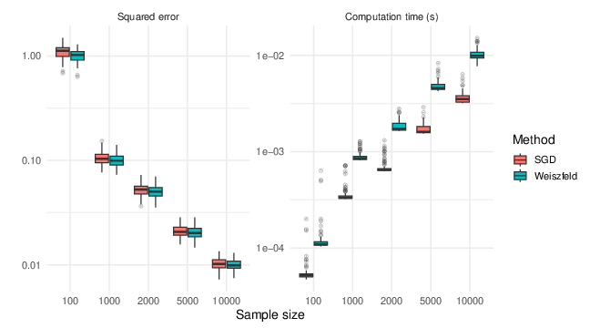
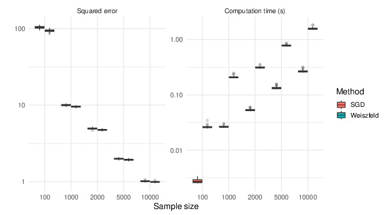

```{r, include = FALSE}
knitr::opts_chunk$set(
  collapse = TRUE,
  comment = "#>"
)
```

Observe that all the functions given here have analogous ones implemented in the `R` package `Gmedian`, but we provide a new version to harmonize arguments and returns.

# Geometric median

In all that follows, we consider a random variable $X$ taking values in $\mathbb{R}^p$, for some integer $p \geq 2$. The geometric median $m$ of $X$ is defined as the minimizer of the convex functional $G : \mathbb{R}^p \to \mathbb{R}$, given for all $h \in \mathbb{R}^p$ by \cite{Hal48}:

\[
G(h) := \mathbb{E} \left[ \| X - h \| - \| X \| \right],
\]

where $\| \cdot \|$ denotes the Euclidean norm. The subtraction of the constant term $\|X\|$ ensures that no assumption is required on the existence of the first-order moment of $X$. Moreover, if the distribution of $X$ is not concentrated near a straight line, the geometric median is uniquely defined \cite{Kem87}. It is well known that when the distribution of $X$ is symmetric, the geometric median coincides with the mean.  

A key advantage of the geometric median is its robustness: it has a breakdown point of 50%, meaning that up to half the data can be arbitrarily corrupted without causing the estimator to diverge. In contrast, the mean has a breakdown point of 0% and is highly sensitive to outliers.  

One can also consider a weighted version of the geometric median. Let $w \in [0,1]$ be a random weight, and define the functional:

\[
G(h) := \mathbb{E} \left[ w \| X - h \| - w \| X \| \right].
\]

This extends the concept of the geometric median to weighted data, allowing for more flexible modeling.

##  Weiszfeld algorithm

A common approach to estimating the geometric median is to use an M-estimator based on a sample. More precisely, let $X_1, \ldots, X_N$ be i.i.d. copies of the random variable $X$, and let $w_1, \ldots, w_N \in [0,1]$ be associated weights. One then considers the empirical functional $G_N : \mathbb{R}^p \to \mathbb{R}$, defined for all $h \in \mathbb{R}^p$ by

\[
G_N(h) := \frac{1}{N} \sum_{i=1}^{N} w_i \left( \|X_i - h\| - \|X_i\| \right).
\]

Contrary to the empirical mean, this functional does not admit a closed-form minimizer; hence, the empirical geometric median must be computed approximately. A standard method for this task is the **Weiszfeld algorithm** [@weiszfeld1937point], which iteratively refines an estimate of the median. See also [@VZ00, beck2013weiszfeld] for more recent studies and convergence results. The procedure is described below:

1. **Input:**
   - Set iteration counter $t \gets 0$
   - Choose an initial point $m^{(0)}$ (e.g., the sample mean)
   - Set tolerance $\varepsilon > 0$ and maximum iterations $T_{\max}$

2. **Repeat until convergence or maximum iterations:**

   1. Set `num = 0` and `den = 0`
   2. For each $i = 1, \dots, N$:
      - If $m^{(t)} \neq X_i$, compute the weight  
        $v_i = \dfrac{w_i}{\|X_i - m^{(t)}\|_2}$
      - Update the accumulators:  
        $\text{num} = \text{num} + v_i * X_i$  
        $\text{den} = \text{den} + v_i$
   3. Compute the new iterate  
      $m^{(t+1)} = \dfrac{\text{num}}{\text{den}}$
   4. Increment $t \gets t + 1$

3. **Stop** when $\|m^{(t+1)} - m^{(t)}\|_2 < \varepsilon$ or $t > T_{\max}$

4. **Return** final estimate $m^{(t+1)}$ 

The Weiszfeld algorithm can be interpreted either as a fixed-point iteration or as a gradient descent method applied to a convex but non-smooth objective function. This algorithm has been extensively studied and refined over the years (see, e.g., [@beck2013weiszfeld] and references therein). In particular, the asymptotic efficiency of the resulting estimators has been established by [@VZ00].

We provide a reference implementation in the function `WeiszfeldMedian`,
which takes the following arguments:

-   **`X`**: A matrix of size $N \times p$ containing the data, where each
    row is an observation.\
-   **`init`**: Initial guess for the median (default is the zero
    vector).\
-   **`weights`**: A vector of weights of length $N$ (default is a vector
    of ones).\
-   **`epsilon`**: Tolerance for the stopping criterion (default is
    $10^{-8}$).\
-   **`nitermax`**: Maximum number of iterations (default is `100`).

The function returns the estimated geometric median.

### Example of use

```{r, echo=TRUE, results='verbatim'}
N <- 1000
p <- 4
X <- matrix(rnorm(N * p), ncol = p)

# Compute Weiszfeld geometric median
res <- STARRS::WeiszfeldMedian(X)

res
```

##  Averaged Stochastic Gradient Algorithm

In the case of moderate sample sizes in moderate dimensions, the Weiszfeld algorithm is very efficient. However, it can become computationally expensive when applied to large-scale data in high-dimensional or functional spaces (see [@HC] for a detailed discussion). In such scenarios, one may prefer a stochastic gradient algorithm [@robbins1951], or its averaged version (ASGD) [@ruppert1988efficient;@PolyakJud92; @HC], which is described below.


1. **Input:**
   - Parameters $c_\gamma > 0$, $\gamma \in (0.5, 1)$
   - Initialization $m_0 = \overline{m}_{0} \in \mathbb{R}^p$

2. **Procedure:**  For $k = 0$ to $N-1$:
      - Compute step size:
        \[
        \gamma_{k+1} \gets c_\gamma \cdot (k+1)^{-\gamma}
        \]
      - Update iterate:
        \[
        m_{k+1} \gets m_k + \gamma_{k+1} \cdot w_{k+1} \cdot \frac{X_{k+1} - m_k}{\| X_{k+1} - m_k \|}
        \]
      - Update averaged iterate:
        \[
        \overline{m}_{k+1} \gets \overline{m}_k + \frac{1}{k+2} \cdot ( m_{k+1} - \overline{m}_k )
        \]

3. **Return:** final estimate $\overline{m}_N$


This algorithm has been extensively studied in recent years. For example, [@HC] established the asymptotic efficiency of the estimates, while [@godichon2015] provided $L^p$ and almost sure convergence rates. Additionally, non-asymptotic confidence balls are available from [@CCG2015].

Another alternative for online estimation of the geometric median is the stochastic Newton algorithm [@GBL2023]. This method is particularly useful when the distribution of $X$ is highly concentrated along a straight line. However, due to its higher computational cost, we do not provide an implementation here.


The ASGD algorithm is implemented in the function `ASGMedian`, which
takes the following arguments:

-   **`X`**: A matrix of size $N \times p$ corresponding to the data (rows
    are observations).\
-   **`init`**: Initial value for the median (default is the zero
    vector).\
-   **`weights`**: A vector of size $N$ containing weights (default:
    ones).\
-   **`gamma`**: ASG step-size parameter (default: `2`).\
-   **`alpha`**: ASG decay rate parameter (default: `0.75`).\
-   **`nstart`**: Number of restarts for the ASG algorithm (default:
    `1`).\
-   **`epsilon`**: Stopping criterion (algorithm stops when consecutive
    iterations differ by less than this threshold, default: `1e-8`).\
-   **`nitermax`**: Maximum number of iterations (default: `100`).

It returns the estimated geometric median.

### Example of use

```{r, echo=TRUE, results='verbatim'}
N <- 1000
p <- 4
X <- matrix(rnorm(N * p), ncol = p)

# Compute ASG geometric median
# Ensure the ASGMedian function is available (from STARRS package)
res <- STARRS::ASGMedian(X)

# Display result
res
```

##  Comparison 

We consider a Gaussian random vector $X \sim \mathcal{N}(0, I_p)$ with $p = 100$. In Figure \ref{fig-median}, we generate $100$ replications for sample sizes $100$, $1000$, $2000$, $5000$, and $10000$. For each replication, we compute both the squared estimation error and the computation time of the two methods: the Weiszfeld algorithm  and the ASGD algorithm.

As shown in the figure beside, while the Weiszfeld algorithm provides slightly better estimation accuracy than ASGD, it is significantly more computationally demanding, especially as the sample size increases (see also [@HC]).

```{r fig-median, fig.cap="Comparison of the squared errors and computation time between Weiszfeld and ASGD algorithms with respect to the sample size.", out.width="70%", fig.align='center', echo=FALSE,eval=TRUE}

```

#  Median Covariation Matrix

We continue to consider a random variable $X$ taking values in $\mathbb{R}^p$. The *Median Covariation Matrix* (MCM for short) of $X$, denoted by $V$, is a robust alternative to the classical covariance matrix. It is defined as the minimizer of the functional $G_m : \mathcal{M}_p(\mathbb{R}) \to \mathbb{R}$, given for any square matrix $M \in \mathcal{M}_p(\mathbb{R})$ by [@KrausPanaretos2012;@CG2015]:

$$
G_m(M) := \mathbb{E} \left[ \left\| (X - m)(X - m)^\top - M \right\|_{F} - \left\| (X - m)(X - m)^\top \right\|_{F} \right],
$$

where $\| \cdot \|_{F}$ denotes the Frobenius norm, and $m$ is the geometric median of $X$. As in the case of the median, the subtraction of the term $\left\| (X - m)(X - m)^\top \right\|_{F}$ ensures that the functional is well-defined without requiring the existence of second-order moments. Moreover, $V$ can be interpreted as the geometric median of the random matrix $(X - m)(X - m)^\top$, and thus its uniqueness is guaranteed as long as the distribution of $X$ is not concentrated along a straight line.

As with the median, a weighted version can also be considered. Given a random weight $w \in [0,1]$, the MCM $V$ is then defined as the minimizer of the functional:

$$
G_m(M) := \mathbb{E} \left[ w \left\| (X - m)(X - m)^\top - M \right\|_{F} - w \left\| (X - m)(X - m)^\top \right\|_{F} \right].
$$

In practice, the MCM can be approximated using either a Weiszfeld-type algorithm or an averaged stochastic gradient algorithm, as described in [@CG2015].

##  Weiszfeld algorithm for estimating the MCM

As in the case of the geometric median, one can consider a (weighted)
empirical version of the functional for the Median Covariation Matrix
(MCM). 
For any $M \in \mathcal{M}_{p}(\mathbb{R})$, define

$$
G_{m,n}(M) = \frac{1}{N} \sum_{i=1}^{N} w_i \left\| (X_i - m)(X_i - m)^\top - M \right\|_{F} - w_i \left\| (X_i - m)(X_i - m)^\top \right\|_{F},
$$

where the weights $w_i$ lie in $[0,1]$. This functional can be minimized using a Weiszfeld-type algorithm. In practice, the geometric median $m$ is typically unknown and must be replaced by an estimate $\hat{m}$ computed via either the Weiszfeld algorithm or the ASGD algorithm. Consequently, one aims to minimize the modified functional

$$
G_{\hat{m},n}(M) = \frac{1}{N} \sum_{i=1}^{N} w_i \left\| (X_i - \hat{m})(X_i - \hat{m})^\top - M \right\|_{F} - w_i \left\| (X_i - \hat{m})(X_i - \hat{m})^\top \right\|_{F}.
$$

This leads to the Weiszfeld-type algorithm for computing the MCM, which can be described step by step as follows:

1.  **Input:**

    -   Set $k \gets 0$\
    -   Choose an initial matrix
        $V^{(0)} \in \mathcal{M}_p(\mathbb{R})$\
    -   Set tolerance $\varepsilon > 0$ and maximum number of iterations
        $T_{\max}$

2.  **Repeat until convergence or maximum iterations:**

    1.  Set $\text{num} = 0$ and $\text{den} = 0$\
    2.  For each $i = 1, \dots, N$:
        -   Compute $A_i = (X_i - \hat{m})(X_i - \hat{m})^\top$\
        -   If $V^{(k)} \neq A_i$:
            -   $v_i = w_i / \|A_i - V^{(k)}\|_F$\
            -   $\text{num} = \text{num} + v_i * A_i$\
            -   $\text{den} = \text{den} + v_i$\
    3.  Update $V^{(k+1)} = num / den$\
    4.  Increment $k \gets k + 1$

3.  **Stop** when $\|V^{(k)} - V^{(k-1)}\|_F < \varepsilon$ or
    $k > T_{\max}$

4.  **Return** the final estimate $V^{(k)}$

Contrary to the case of the geometric median, there is currently no theoretical guarantee ensuring the convergence of the Weiszfeld algorithm for estimating the Median Covariation Matrix (MCM) when the true median $m$ is unknown and replaced by an estimate $\hat{m}$.

The method is implemented in the function `WeiszfeldMedianCovariance`,
which accepts the following arguments:

-   **`X`**: A matrix of size $N \times p$ representing the data, where
    each row is an observation.\
-   **`median_est`**: An estimate of the median, defaulting to
    `WeiszfeldMedian(X)$median`.\
-   **`init_cov`**: Initial value for the MCM, defaulting to the identity
    matrix.\
-   **`weights`**: A vector of size $N$ containing the weights, defaulting
    to ones.\
-   **`epsilon`**: Convergence threshold for the stopping criterion,
    default is `1e-08`.\
-   **`nitermax`**: Maximum number of iterations, default is `100`.

It returns the estimated MCM.

### Example of use
```{r, echo=TRUE, results='verbatim'}
N <- 1000
p <- 4
X <- matrix(rnorm(N * p), ncol = p)

# Compute Weiszfeld geometric median
med_est <- STARRS::WeiszfeldMedian(X)

# Compute the associated Median Covariation Matrix
res <- STARRS::WeiszfeldMedianCovariance(X, median_est = med_est)

res
```

##  Averaged stochastic gradient algorithm for estimating the MCM

As in the case of the geometric median, one can estimate the Median Covariation Matrix (MCM) using a stochastic gradient algorithm and its averaged version \cite{CG2015}. Since the true median is typically unknown in practice, it must be replaced by an estimate, obtained, for example, using `WeiszfeldMedian()` or `ASGMedian()`. This leads to the following procedure.

1. **Input:**
   - Parameters $c_\gamma > 0$, $\gamma \in (0.5, 1)$
   - Initial matrix $V_0$
   - Estimate of the median $\hat{m}$
   - Initialization $\overline{V}_0 \gets V_0 \in \mathcal{M}_{p}(\mathbb{R})$

2. **For** $k = 0$ to $N - 1$:
   1. Compute the step size  
      \[
      \gamma_{k+1} = c_\gamma \, (k+1)^{-\gamma}
      \]
   2. Update the stochastic gradient  
      \[
      V_{k+1} = V_k + \gamma_{k+1} \, w_{k+1} \,
      \frac{(X_{k+1} - \hat{m})(X_{k+1} - \hat{m})^\top - V_k}
           {\| (X_{k+1} - \hat{m})(X_{k+1} - \hat{m})^\top - V_k \|_F}
      \]
   3. Update the averaged estimate  
      \[
      \overline{V}_{k+1} = \overline{V}_k + \frac{1}{k+2} \, (V_{k+1} - \overline{V}_k)
      \]

3. **Return:** the final averaged MCM estimate $\overline{V}_N$

The algorithm is implemented in the function `ASGMedianCovariance`,
which accepts the following arguments:

-   **`X`**: A matrix of size $N \times p$ representing the data, where
    each row is an observation.\
-   **`median_est`**: An estimate of the median.\
-   **`init_cov`**: Initial value of the MCM, by default set to the
    identity matrix.\
-   **`weights`**: A vector of size $N$ of weights, defaulting to 1.\
-   **`gamma`**: Step size constant (default: 2).\
-   **`alpha`**: Step size decay rate (default: 0.75).\
-   **`nstart`**: Number of random starts (default: 1).\
-   **`epsilon`**: Convergence threshold (default: 1e-8).\
-   **`nitermax`**: Maximum number of iterations (default: 100).

It returns the estimated median covariation matrix.


### Example of use

```{r, echo=TRUE, results='verbatim'}
N <- 1000
p <- 4
X <- matrix(rnorm(N * p), ncol = p)

# Compute the median using ASGMedian
med_est <- STARRS::ASGMedian(X)

# Compute the associated Median Covariation Matrix
res <- STARRS::ASGMedianCovariance(X, median_est = med_est)
res
```

##   Comparison of the methods

We consider a Gaussian random vector $X \sim \mathcal{N}(0, I_p)$ with $p = 100$. We generate 100 samples of sizes 100, 1000, 2000, 5000, and 10000, and compute both the squared error of estimation and the computation time for each method (Weiszfeld given by `WeiszfeldMedianCovariance()` and ASGD given by `ASGMedianCovariance()`).

As shown in the figure beside, while the Weiszfeld algorithm performs slightly better than ASGD in terms of estimation error, it is considerably more computationally expensive (see also \cite{CG2015}).


```{r fig-MCM, ffig.cap="Comparison of the squared errors and computation time between Weiszfeld and ASGD algorithms with respect to the sample size.", out.width="70%", fig.align='center', echo=FALSE,eval=TRUE} 

```


#  References

<div id="refs"></div>

