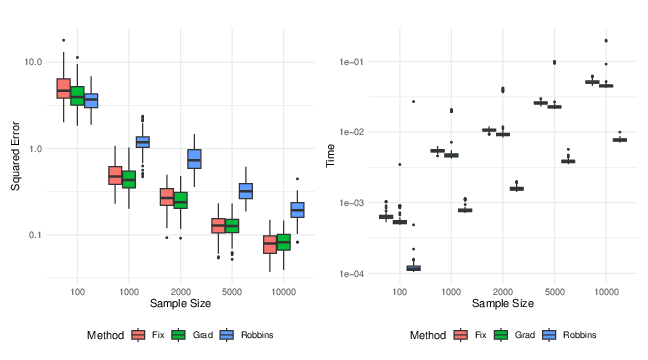
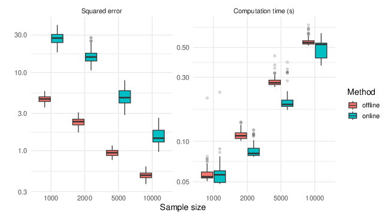

```{r, include = FALSE}
knitr::opts_chunk$set(
  collapse = TRUE,
  comment = "#>"
)
```

# Framework

In all the sequel, we suppose that $X$ is a random vector lying in $\mathbb{R}^{p}$ with mean $\mu$ and positive variance $\Sigma$. Let us recall that the geometric median $m$ of $X$ is defined as the minimizer of the convex functional $G : \mathbb{R}^p \to \mathbb{R}$, given for all $h \in \mathbb{R}^p$ by \cite{Hal48}:

\[
G(h) := \mathbb{E} \left[ \| X - h \| - \| X \| \right],
\]

where $\| \cdot \|$ denotes the Euclidean norm.The median can be computed using one of two available algorithms, implemented respectively in the functions `WeiszfeldMedian` and `ASGMedian`.
If the distribution of $X$ is symmetric, then the mean $\mu$ of $X$ coincides with its median $m$. Unfortunately, there is no direct robust alternative of the variance. Nevertheless one can focus on the Median Covariance Matrix, defined as the minimizer of the functional $G_m : \mathcal{M}_p(\mathbb{R}) \to \mathbb{R}$, given for any square matrix $M \in \mathcal{M}_p(\mathbb{R})$ by [@KrausPanaretos2012;@CG2015]:

$$
G_m(M) := \mathbb{E} \left[ \left\| (X - m)(X - m)^\top - M \right\|_{F} - \left\| (X - m)(X - m)^\top \right\|_{F} \right],
$$
where $\| . \|_{F}$ denotes the Frobenius norm for matrices. The median covariance matrix can be computed using one of two available algorithms, implemented respectively in the functions `WeiszfeldMedianCovariance` and `ASGMedianCovariance`. When the distribution of $X$ is symmetric, the median covariance matrix $V$ and the usual covariance matrix $\Sigma$ are not equal, but they share the same eigenvectors (see Proposition 2 in [@KrausPanaretos2012]).  Moreover, denoting by $\delta$ the vector containing the eigenvalues of $V$ and $\lambda$ the one for $\Sigma$, one has (Proposition 2 in [@KrausPanaretos2012]):

\[
\delta =  \frac{\mathbb{E} \left[ \frac{\lambda \odot U^{\otimes 2}}{h\left(\lambda,\delta,U \right)} \right] }{ \mathbb{E} \left[ \frac{1}{h\left(\lambda,\delta,U \right)} \right]}.
\]

where $U \sim \Sigma^{-1/2}(X-m)$, $\lambda \odot U$ denotes the Hadamard product of the vectors $\lambda$ and $U$, and  $U^{\otimes 2} = U \odot U$.   Additionally,

\begin{equation}\label{def::h}
h(\lambda, \delta, U) := \sum_k (\delta[k] - \lambda[k] U[k]^2)^2 + \sum_{i \neq j} U[i]^2 U[j]^2  {\lambda[i]}  {\lambda[j]}.
\end{equation}

Then, one can use this relation to obtain robust estimates of the eigenvalues of the variance, and thereafter a robust estimate of the variance $\Sigma$.


# Robust estimates of the eigenvalues of the variance

The relation between $\delta$ and $\lambda$ given above allows us to reformulate the problem of finding $\lambda$ as the search for the zero of a function. More precisely, denoting $A = \operatorname{diag}(U[1]^2, \ldots, U[p]^2)$, the objective is to determine $\lambda$ such that:

\[
\mathbb{E}\left[ \frac{A \lambda - \delta}{ {h(\lambda, \delta, U)}} \right] = 0.
\]

Let us also suppose from now that one can generate i.i.d. copies $U_{1}, \ldots , U_{N}$ of $U$. For instance, in the case where $X$ is a Gaussian vector, it means that $U$ is a standardized Gaussian vector, and one can easily simulate $N$ copies.  Then, one can consider the empirical version of the above equation, and three algorithms for estimating the eigenvalues of $\Sigma$ are available (see [@godichon2024robust]):  a Robbins–Monro algorithm, a gradient-type algorithm, and a fixed-point algorithm.


## Robbins–Monro algorithm for estimating robustly the eigenvalues of the variance

Of course, one usually does not have access to the eigenvalues of the Median Covariation Matrix (MCM), nor to the MCM itself. Then, one can estimate the MCM with the help of Algorithm `weiszfeldMedianCovariance` or `ASGMedianCovariance`, before approximating its eigenvalues, to obtain an estimate $\hat{\delta}$ of the vector of eigenvalues.  The **Robbins–Monro procedure** [@robbins1951; @godichon2024robust] for estimating the eigenvalues of the variance can then be described step by step as follows:

1. **Input:** 
   - $U_1, \dots, U_N \in \mathbb{R}^p$,  
   - initial value $\lambda_{0} = \overline{\lambda}_{0} \in \mathbb{R}^p$,  
   - Estimated eigenvalues of the MCM $\hat{\delta} \in \mathbb{R}^p$,  
   - Define constants:  
     $c_\gamma > 0$, $\gamma \in (0.5, 1)$, $n_0 \ge 0$, $\omega \ge 0$  
   - Set $S_0 = 1$  

2. **Repeat for** $n = 0, \dots, N - 1$:

   1. Compute  
      $A_{n+1} = \mathrm{diag}(U_{n+1}[1]^2, \dots, U_{n+1}[p]^2)$  
   2. Compute the step size  
      $\gamma_{n+1} = c_\gamma (n + 1 + n_0)^{-\gamma}$  
   3. Update the current estimate  
      $$
      \lambda_{n+1}
      = \lambda_n
        - \gamma_{n+1}
          \frac{A_{n+1}\lambda_n - \hat{\delta}}
               { \sqrt{h(\lambda_n, \hat{\delta}, U_{n+1})}}
      $$
   4. Compute the weight  
      $w_{n+1} = \log(n + 1)^{\omega}$  
   5. Update the cumulative weight  
      $S_{n+1} = S_n + w_{n+1}$  
   6. Update the averaged estimate  
      $$
      \overline{\lambda}_{n+1}
      = \overline{\lambda}_n
        + \frac{w_{n+1}}{S_{n+1}}
          (\lambda_{n+1} - \overline{\lambda}_n)
      $$

3. **Return** the final averaged estimate $\overline{\lambda}_N$


The algorithm is implemented in the function `RobbinsMC`, which takes the following arguments:

- **`U`**: a matrix of size $N \times p$ corresponding to a sample of $\Sigma^{-1/2}(X - \mu)$. Each row represents one observation.

- **`delta`**: a vector of length `p` containing the eigenvalues of the *median covariation matrix* (MCM).

- **`init`**: initial value of the eigenvalues of the variance–covariance matrix (by default equal to `delta`).

- **`gamma`**: Robbins–Monro parameter (default: `0.75`).

- **`c`**: Robbins–Monro parameter (default: `2`).

- **`w`**: Robbins–Monro parameter (default: `2`).

- **`epsilon`**: stopping criterion. The algorithm stops when the difference between two iterations is less than `epsilon` (default: `1e-8`).

- **`out_index`**: indexes of iterations for which we want to store the estimates (default: number of observations `N`).

The function returns a **list** containing:\
- **`lambda`**: the estimated eigenvalues,\
- **`iter`**: the number of iterations performed,\
- **`vp`**: the values of intermediate estimates (if requested).

\textcolor{red}{Attention ! Travailler la sortie avec Daphné}


### Example of use

```{r}

# Define the true covariance matrix
Sigma <- diag(2:1)
N <- 5000

# Generate Gaussian data
X <- mvtnorm::rmvnorm(N, sigma = Sigma)

# Compute the geometric median
med <- STARRS::WeiszfeldMedian(X)

# Compute the Median Covariation Matrix (MCM)
MCM <- STARRS::WeiszfeldMedianCovariance(X, median_est = med)

# Extract its eigenvalues
delta <- eigen(MCM)$values
p <- length(delta)

# Generate U = Sigma^{-1/2}(X - mu)
U <- matrix(rnorm(N * p), ncol = p)

# Run the Robbins–Monro estimation
lambda <- STARRS::robbinsMC(U = U, delta = delta, init = delta)

# Display the estimated eigenvalues
lambda
```


## Fixed-point algorithm for estimating the eigenvalues of the variance

Given an estimate $\hat{\delta}$ of the vector of the eigenvalues of the Median Covariance Matrix,  the **fixed-point algorithm** [@godichon2024robust] provides a robust method to estimate the eigenvalues of the variance–covariance matrix.

The algorithm proceeds as follows:

1. **Input:**
   - Observations $U_1, \dots, U_N \in \mathbb{R}^p$
   - Initial value $\lambda^{(0)} \in \mathbb{R}^p$
   - Estimated eigenvalues of the MCM $\hat{\delta} \in \mathbb{R}^p$
   - Tolerance $\varepsilon > 0$
   - Maximum number of iterations $T_{\max}$

2. **Iterate until convergence or maximum iterations:**
   1. Initialize $\text{num} = 0$ and $\text{den} = 0$
   2. For each $i = 1, \dots, N$:
      - Compute  
        $$ w_i =1/ \sqrt{h(\hat{\delta}, \lambda^{(k)}, U_i)}$$  
      - Update accumulators:  
        $\text{num} = \text{num} + w_i$  
        $\text{den} = \text{den} + U_i^{\otimes 2} * w_i$  (where $\otimes$ is the elementwise product)
   3. Update  
      $\lambda^{(k+1)} = \hat{\delta} * (\text{num} \oslash \text{den})$  
      (where $\oslash$ denotes coordinate-wise division)
   4. If $\|\lambda^{(k+1)} - \lambda^{(k)}\| \leq \varepsilon$, stop.

3. **Return:** the final estimate $\lambda^{(k+1)}$.


The algorithm is implemented in the function `FixMC`, which estimates the eigenvalues of the variance–covariance matrix based on a fixed-point procedure [@godichon2024robust].

The function takes the following arguments:

- **`U`**: a matrix of size $N \times p$ corresponding to $\Sigma^{-1/2}(X - \mu)$.  The rows are the observations.

- **`delta`**: a vector of size `p` containing the eigenvalues of the *Median Covariation Matrix (MCM)*.

- **`init`**: the initial value of the vector of eigenvalues of the variance–covariance matrix (default: `delta`).

- **`niter`**: maximum number of iterations for the algorithm (default: `10`).

- **`epsilon`**: stopping criterion. The algorithm stops when the difference between two iterations is less than `epsilon` (default: `1e-8`).

- **`out_index`**: indexes of the iterations for which the estimates should be output (default: last iteration).

The function returns a **list** containing:\
- **`vp`**: the estimated eigenvalues,\
- **`iter`**: the number of iterations performed,\
- **`vplist`**: the values of intermediate estimates (if requested).

\textcolor{red}{Attention ! Regarder les sorties avec Daphné !}

### Example of use

```{r}


# Define the true covariance matrix
Sigma <- diag(2:1)
N <- 5000

# Generate Gaussian data
X <- mvtnorm::rmvnorm(N, sigma = Sigma)

# Compute the geometric median
med <- STARRS::WeiszfeldMedian(X)

# Compute the Median Covariation Matrix (MCM)
MCM <- STARRS::WeiszfeldMedianCovariance(X, median_est = med)

# Extract its eigenvalues
delta <- eigen(MCM)$values
p <- length(delta)

# Generate standardized observations U = Σ^{-1/2}(X - μ)
U <- matrix(rnorm(N * p), ncol = p)

# Run the fixed-point estimation
lambda <- STARRS::fixMC(U = U, delta = delta, init = delta)

# Display the estimated eigenvalues
lambda
 
```


##  Gradient-type algorithm  

Given an estimate $\hat{\delta}$ of the vector of the eigenvalues of the Median Covariance Matrix, the **gradient-type algorithm** [@godichon2024robust] estimates the eigenvalues of the variance–covariance matrix as  follows:

1. **Input:** sample $U_1, \dots, U_N \in \mathbb{R}^p$,  
   initial value $\lambda^{(0)} \in \mathbb{R}^p$,  
   Estimated eigenvalues of the MCM $\hat{\delta} \in \mathbb{R}^p$,  
   step-size sequence $\{\eta_k\}_{k \geq 0}$,  
   tolerance $\varepsilon > 0$,  
   and maximum number of iterations $T_{\max}$.

2. **For** each iteration $k = 0, 1, \dots, T_{\max}-1$:  
   a. Initialize the gradient $\leftarrow 0$ (vector of length $p$).  
   b. For each observation $i = 1, \dots, N$:  
   &nbsp;&nbsp;&nbsp;&nbsp;• Compute $w_i \leftarrow \sqrt{h(\hat{\delta}, \lambda^{(k)}, U_i)}$  
   &nbsp;&nbsp;&nbsp;&nbsp;• Compute $g_i \leftarrow \left(U_i^{\otimes 2} \otimes \lambda^{(k)} - \hat{\delta}\right) / w_i$  
   &nbsp;&nbsp;&nbsp;&nbsp;• Update gradient $\leftarrow$ gradient $+ g_i$  
   c. Update $\lambda^{(k+1)} \leftarrow \lambda^{(k)} - \eta_k \cdot \text{gradient}$  
   d. If $\|\lambda^{(k+1)} - \lambda^{(k)}\| \leq \varepsilon$, **stop**.

3. **Output:** $\lambda^{(k+1)}$


The algorithm is implemented in the function `gradMC` with the following arguments:

- **`U`**: a matrix of size $N \times p$ corresponding to $\Sigma^{-1/2}(X - \mu)$. The rows are the observations.
- **`delta`**: vector of length `p` containing the eigenvalues of the MCM.  
- **`init`**: initial vector of eigenvalues of the variance–covariance matrix (default: `delta`).  
- **`niter`**: maximum number of iterations for the gradient descent algorithm (default: `10`).  
- **`epsilon`**: stopping criterion — stops when the difference between two iterations is less than `1e-8`.  
- **`step`**: step size of the gradient descent (default: `1`).  
- **`out_index`**: indexes of iterations for which the estimates are returned (default: last iteration).  

The function returns a **list** containing:\
- **`vp`**: the estimated eigenvalues,\
- **`iter`**: the number of iterations performed,\
- **`vplist`**: the values of intermediate estimates (if requested).


###  Example of use

```{r}
# Load required packages
library(mvtnorm)
library(STARRS)

# Define the true covariance matrix
Sigma <- diag(2:1)
N <- 5000

# Generate Gaussian data
X <- mvtnorm::rmvnorm(N, sigma = Sigma)

# Compute the geometric median
med <- STARRS::WeiszfeldMedian(X)

# Compute the Median Covariation Matrix (MCM)
MCM <- STARRS::WeiszfeldMedianCovariance(X, median_est = med)

# Extract eigenvalues of the MCM
delta <- eigen(MCM)$values
p <- length(delta)

# Generate standardized observations
U <- matrix(rnorm(N * p), ncol = p)

# Run the gradient algorithm
lambda <- STARRS::gradMC(U = U, delta = delta, init = delta)

# Display the estimated eigenvalues
lambda
```


##  Comparison of the methods

In order to compare the different methods, we consider a random variable  $X \sim \mathcal{N}\left( 0 , \Sigma \right)$ where $\Sigma = \text{Diag} \left( 1 , \sqrt{2} , \ldots , \sqrt{d} \right)$ and $d = 20$.  To obtain an accurate estimate of the Median Covariance Matrix, we first generate $n = 10^{6}$ independent realizations of $X$ and apply the Weiszfeld algorithm to estimate the MCM.   The eigenvalues of this estimated MCM are computed using the R function `eigen`.
 Then, to assess and compare the three algorithms, we generate $100$ replications of $U \sim \mathcal{N}(0, I_d)$ for several sample sizes   $N \in \{100, 200, 2000, 5000, 10000\}$.

For each method, we compute:\
1. The **squared error** between the estimated and true eigenvalues of the covariance.\  
2. The **computational time** (in seconds).

Figure below shows the comparison of squared errors and computation times.  We observe that the Robbins–Monro method is slightly less accurate than the others, but its computation time is divided by about **15**.  Hence, it appears to be the preferred choice in large-scale or streaming contexts.


```{r fig-vp, fig.cap='Comparison of the squared errors and computational time between the three methods (Robbins–Monro, Gradient, and Fixed-point) as a function of the sample size.', out.width="70%", fig.align='center', echo=FALSE,eval=TRUE}

```

# Robust estimation of the variance
## Offline Robust Variance Estimation

In all the sequel, we consider that \(X\) is a random vector of mean \(\mu\) and variance \(\Sigma\), and we assume that it is possible to simulate according to
$U = \Sigma^{-1/2} (X - \mu)$. Given a sample \(X_1, \ldots, X_N\), the robust estimate of the variance consists in obtaining an estimate of the median and the MCM with the help of the Weiszfeld algorithms given by Algorithms `WeiszfeldMedian` and `WeiszfeldMedianCovariance`, before approximating the eigenvalues (resp. eigenvectors) of the MCM with the help of the R function `eigen` and we denote by \(\hat{\delta}\) (resp. \(\hat{P}\)) these approximations. Then one can generate \(n\) independent realizations \(U_1, \ldots, U_n\) with the same law as $U$. Then, one can choose one of the three methods (Robbins-Monro given by Algorithm `robbinsMC`, gradient given by Algorithm `gradMC` or fix point given by Algorithm `fixMC`) for obtaining an estimate \(\hat{\lambda}\) of the eigenvalues of the covariance. Then, one can obtain a robust estimate of the variance with

\[
\hat{\Sigma} = \hat{P} \, \text{Diag}(\hat{\lambda}) \, \hat{P}^{T}.
\]

This is given by the following Algorithm:


1. **Input:** sample $X_1, \dots, X_N$
Number of Monte Carlo iterations $n_{MC}$

2. **Compute the robust median:**  
   - `mu_hat <- WeiszfeldMedian(X)`  

3. **Compute the Median Covariation Matrix (MCM):**  
   - `Gamma_hat <- WeiszfeldMedianCovariance(X, median_est = mu_hat)`  

4. **Eigen-decomposition of the MCM:**  
   - `(delta_hat, P_hat) <- eigen(Gamma_hat)`  
     - `delta_hat`: eigenvalues  
     - `P_hat`: eigenvectors  

5. **Generate Monte Carlo samples** $\mathbf{U} = \left( U_1, \dots, U_{n_{MC}} \right)$ with  $U_{i} \sim U$.

6. **Estimate eigenvalues of the variance** using one of the three methods:  
   - `lambda_hat <- RobbinsMC(\mathbf{U}, delta_hat)` **or**  
   - `lambda_hat <- gradMC(\mathbf{U}, delta_hat)` **or**  
   - `lambda_hat <- fixMC(\mathbf{U}, delta_hat)`  

7. **Reconstruct the robust variance estimate:**  
   \[
   \hat{\Sigma} = P_{\text{hat}} \cdot \text{Diag}(\lambda_{\text{hat}}) \cdot P_{\text{hat}}^T
   \]

8. **Output:**  
   - `Sigma_hat` : estimated covariance  
   - `mu_hat` : median  
   - `Gamma_hat` : MCM  
   - `delta_hat`, `P_hat` : eigenvalues and eigenvectors of MCM


\textcolor{red}{Rajouter les entrées et sorties quand ce sera callé avec Daphné}


###  Example of use

```{r}
library(mvtnorm)
library(STARRS)

# Generate sample data
N <- 5000
p <- 3
Sigma <- diag(1:p)
X <- mvtnorm::rmvnorm(N, sigma = Sigma)

# Compute offline robust variance
Variance <- STARRS::onlineRobustVariance(X)

# Display the estimated covariance
Variance$variance
```

## Online robust estimation of the variance

The online robust estimation of the variance, or streaming approach, consists in simultaneously estimating both the median and the Median Covariance Matrix (MCM) using a streaming gradient algorithm [@godichon2023non]. More precisely, at each gradient step (used to estimate the median and the MCM), the algorithm approximates the eigenvalues and eigenvectors of the MCM. Starting from these estimates of the MCM's eigenvalues and from the current estimate of the covariance's eigenvalues, several iterations of the Robbins–Monro algorithm (Algorithm `robbinsMC``) are then performed to obtain a new estimate of the covariance eigenvalues. The covariance matrix can then be reconstructed as in the offline case. 

This is given by the following Algorithm:


1. **Input:**
   - Streaming data blocks $\left\{ \{ X_{n,j} \}_{j=1}^{k} \right\}_{n=1}^{N} \subset \mathbb{R}^p$
   - Step sizes $\gamma_n$
   - Number of Monte Carlo iterations $n_{MC}$
   - Initial median $m_0 = \overline{m}_{0}$
   - Initial MCM $V_0 = \bar{V}_0$ 
   - Initial eigenvalues $\lambda_0$

2. **Iterate for each block $n = 0, \dots, N-1$:**
   1. Retrieve next block of $k$ observations: `X_block = {X_{n+1,j}}`
   2. **Update median:**
      \[
      m_{n+1} = m_n + \gamma_{n+1} \frac{1}{k} \sum_{j=1}^{k} \frac{X_{n+1,j} - m_n}{\| X_{n+1,j} - m_n \|}, 
      \]
      \[
      \bar{m}_{n+1} = \bar{m}_n + \frac{1}{n+2} ( m_{n+1} - \bar{m}_n )
      \]
   3. **Update MCM (matrix of second moments):**
      \[
      V_{n+1} = V_n + \gamma_{n+1} \frac{1}{k} \sum_{j=1}^{k} 
        \frac{(X_{n+1,j} - \bar{m}_n)(X_{n+1,j} - \bar{m}_n)^\top - V_n}{\| \cdot \|_F}, 
      \]
      \[
      \bar{V}_{n+1} = \bar{V}_n + \frac{1}{n+2} ( V_{n+1} - \bar{V}_n )
      \]
   4. **Eigen-decomposition of averaged MCM:**
      \[
      \delta_{n+1} = \text{eigenvalues}(\bar{V}_{n+1}), \quad
      P_{n+1} = \text{eigenvectors}(\bar{V}_{n+1})
      \]
   5. **Monte Carlo update of covariance eigenvalues:**
      - Generate $\mathbf{U} = \left( U_1, \dots, U_{n_{MC}} \right)$ where $U_{i}  \sim U$
      - Update
        \[
        \lambda_{n+1} = \text{robbinsMC}(\mathbf{U}, \delta_{n+1}, \lambda_n)
        \]
   6. **Reconstruct covariance:**
      \[
      \Sigma_{n+1} = P_{n+1} \, \text{diag}(\lambda_{n+1}) \, P_{n+1}^\top
      \]

3. **Return:** 
   - $\Sigma_N$: estimated covariance  
   - $\bar{m}_N$: estimated median  
   - $\bar{V}_N$: estimated MCM  
   - $\lambda_N$: estimated eigenvalues


\textcolor{red}{Rajouter les entrées et sorties quand ce sera callé avec Daphné}

###  Example of use

```{r}
library(mvtnorm)
library(STARRS)

# Generate sample data
N <- 5000
p <- 3
Sigma <- diag(1:p)
X <- mvtnorm::rmvnorm(N, sigma = Sigma)

# Compute online robust variance
Variance <- STARRS::onlineRobustVariance(X)

# Display the estimated covariance
Variance$variance
```


##  Comparison of the methods

In order to compare the different methods, we consider a random variable \(X \sim \mathcal{N}(0, \Sigma)\) where \(\Sigma = \text{Diag}(1, \sqrt{2}, \ldots, \sqrt{d})\) and \(d = 20\). We generate 100 samples (of \(U \sim \mathcal{N}(0, I_d)\)) of sizes 1000, 2000, 5000, 10000 before considering the squared error of the estimation of the covariance as well as the computational time for each method.

```{r fig-variance, echo=FALSE, fig.cap="Comparison of the different methods for estimating robustly the variance", out.width="50%"}

```


#  References

<div id="refs"></div>
